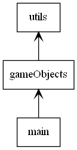
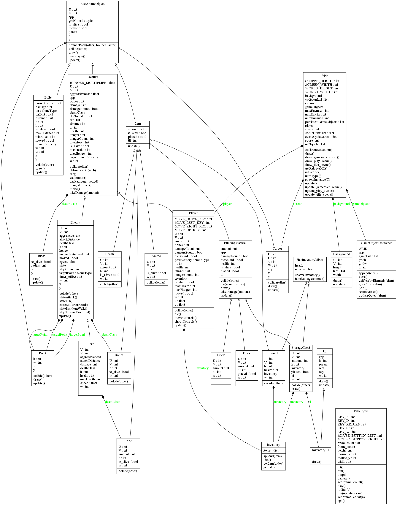

# 2d-survival

run game
- `python main.py`

build executable
- `pyinstaller asrm.exe.spec`

edit assets
- `pyxel edit assets`

# Classes
_this is subject to change and not be updated for a while. The source code is the only **real** source of truth._

## packages

## class UML

## App
- Top level game app
- global game state gets stored here
- top level game logic goes here
## GameObjectContainer
- container type for all game objects
- must implement list methods
## BaseGameObject
- game object
- everything should inherit from this
- should probably make it an abstract base class
## Point
- point object
- used for navigation
- used for bullet paths
## Bullet
- bullets fired from guns
## Cursor
- crosshair overlay
## Blast
- default blast animation
## Background
- background class
## Creature
- base class for living things with hunger n'at
## Player
- user controlled player
## Enemy
- ai controlled enemies

## UI
- ui element base class

# Items
## Ammo
## Brick
## Bones
## Barrel
## Food
## Health
## Bear